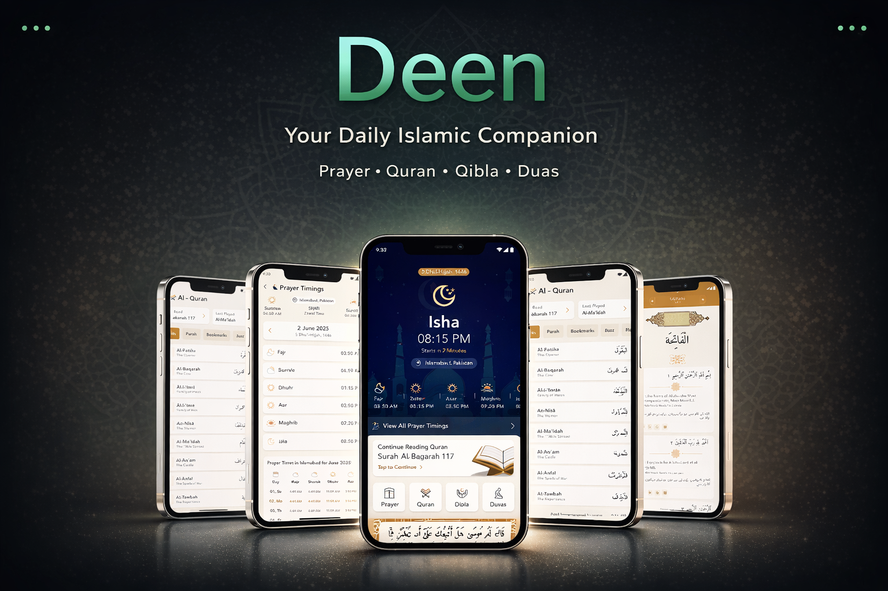

# Deen 🕌

Deen App is a modern Islamic mobile application built with Flutter, designed to help Muslims stay connected with their faith through Qur’an recitation, daily Islamic utilities, and meaningful content — all with offline support.

---

## ✨ Features

### 📖 Qur’an
- Complete **Surahs with Audio Recitation**
- **Bookmarks** to save favorite verses
- **Last Read** tracking for seamless continuation
- **Last Played** audio tracking
- **Verse of the Day** for daily reflection

### 🕋 Prayer & Direction
- **Prayer Times according to user location**
- **Qibla Direction** using device sensors

### 📦 Offline Support
- **Cached data** for faster loading
- Qur’an, Duas, and essential content accessible **offline**

### 🤲 Duas
- Collection of daily life **Islamic supplications**
- Arabic text with translations
- Organized by categories

### 📝 Blogs
- Islamic blogs and articles
- Structured content for future expansion

---

## 🛠️ Tech Stack

- **Framework:** Flutter
- **Language:** Dart
- **State Management:** Bloc
- **APIs & Services:**
  - [Qur’an API (text & audio)](https://alquran.cloud/api)
  - [Prayer Times API (location-based)](https://aladhan.com/prayer-times-api)
  - [Qibla Direction API](https://aladhan.com/qibla-api)

- **Storage:**
  - Local caching (SharedPreferences / Hive / SQLite)
- **Platforms:** Android & iOS

---

## 📱 Screenshots

> Screenshots and mockups will be added soon.

---

## 🚀 Getting Started

### Prerequisites
- Flutter SDK (latest stable)
- Android Studio / VS Code
- Android Emulator or Physical Device

### Installation

```bash
git clone https://github.com/SafuRaja7/Deen.git
cd Deen
flutter pub get
flutter run
```
---

## 👤 Author
Muhammad Saif Waheed Raja
- Flutter Developer | QA Automation Engineer
- GitHub: https://github.com/SafuRaja7

## 🚧 **Work in Progress**
> This project is actively under development.  
> Features, UI, and content are subject to change.

